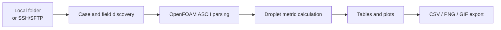
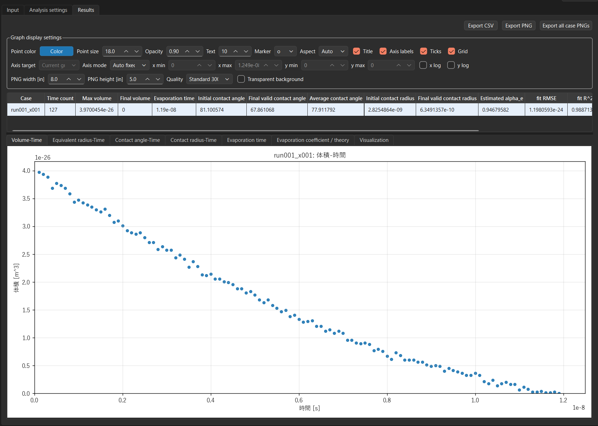

<div align="center">

# mdFOAM Density Analyzer

**Reproducible batch droplet analysis for mdFOAM/OpenFOAM-style molecular simulation outputs.**

[](https://github.com/Kaito-Rowing/mdfoam-density-analyzer/actions/workflows/ci.yml)
[](https://github.com/Kaito-Rowing/mdfoam-density-analyzer/releases/latest)
[](LICENSE)
[](#installation)
[](#application-preview)

[Latest release](https://github.com/Kaito-Rowing/mdfoam-density-analyzer/releases/latest) ·
[Changelog](CHANGELOG.md) ·
[License](LICENSE) ·
[CI](https://github.com/Kaito-Rowing/mdfoam-density-analyzer/actions/workflows/ci.yml)

</div>

## Research Impact

Built for reproducible post-processing of mdFOAM/OpenFOAM-style molecular simulations of nanoscale water droplet evaporation. It replaces a manual ParaView + script workflow with a repeatable Python GUI/CLI-oriented analysis path for comparing tens to roughly 100 simulation cases.

This desktop application reads mdFOAM/OpenFOAM-style simulation results directly in Python and helps inspect droplet volume, equivalent radius, evaporation completion time, contact angle, and contact radius for regions above a density threshold. It works directly on OpenFOAM ASCII files and does not require ParaView or pvpython.

| Focus | What the app does |
| --- | --- |
| Batch analysis | Processes one case or many cases under a parent directory. |
| Droplet metrics | Computes volume, equivalent radius, contact angle, contact radius, and evaporation time. |
| Direct parsing | Reads OpenFOAM ASCII density fields and `constant/polyMesh` files in Python. |
| Desktop workflow | Provides a PySide6 GUI with tables, plots, visualization diagnostics, and CSV/PNG/GIF export. |
| Remote access | Supports SSH/SFTP case discovery and file download without running remote commands. |

## How to Cite

If you use mdFOAM Density Analyzer in research, please cite the software using the metadata in [CITATION.cff](CITATION.cff).

DOI: pending Zenodo archive for the next GitHub release.

```text
Kaito Nakatani. mdFOAM Density Analyzer. Version 0.1.1. 2026.
https://github.com/Kaito-Rowing/mdfoam-density-analyzer
```

## Why This Exists

mdFOAM users often need quantitative post-processing that can be repeated across many related simulation cases. Manual visualization workflows are useful for inspection, but they can be difficult to reproduce exactly when the goal is to compare droplet volume, radius, contact angle, contact radius, and evaporation time across tens or roughly 100 cases.

This project is a desktop application for that narrower research workflow. It reads OpenFOAM ASCII fields and `constant/polyMesh` files directly, computes droplet metrics from density fields, and exports tabular and graphical results for downstream analysis.

## Why mdFOAM Users May Want This Instead of a ParaView-Centered Workflow

ParaView is a general-purpose scientific visualization tool and is widely used in OpenFOAM workflows. This project is not a replacement for ParaView's visualization capabilities.

mdFOAM Density Analyzer is intended for a different task: reproducible, batch-oriented quantitative droplet analysis from mdFOAM/OpenFOAM-style molecular simulation outputs. The application avoids a ParaView/pvpython runtime dependency and instead parses the OpenFOAM ASCII data directly in Python. This makes it easier to run the same analysis settings over many cases, export comparable CSV files, and preserve a repeatable post-processing path.

The contact angle workflow is designed to approximate a previous process where contour points were extracted in ParaView and then processed with `Sesshoku6.py`. Here, density-threshold contour points are reconstructed directly from neighboring cell centers in Python, then the same sphere-fit style calculation is applied.

## Key Features

- Directly reads OpenFOAM ASCII `volScalarField` density fields.
- Computes cell volumes and cell centers from `constant/polyMesh/points`, `faces`, `owner`, and `neighbour`.
- Supports density fields named like `rhoM_*` and `rhoN_*`, with `rhoM_water` as the default.
- Computes droplet volume above a density threshold.
- Computes equivalent radius: `R_eq = (3V / (4*pi))^(1/3)`.
- Computes contact angle, contact radius, and contact fit point count.
- Computes evaporation completion time from consecutive zero-volume time steps.
- Handles a single case or many cases under a parent directory.
- Supports SSH/SFTP workflows for remote HPC results without running commands on the remote host.
- Exports summary CSV, time-series CSV, graph PNG files, visualization PNG files, and visualization GIF files.
- Saves and reloads analysis settings as a versioned `mdfoam_project.json` file.
- Exports a reproducibility-focused `analysis_manifest.json` with settings, input file metadata, mesh statistics, and result summaries.
- Provides a PySide6 desktop GUI with case tables, plots, and visualization diagnostics.
- UI language can be switched between Japanese, English, Chinese, Spanish, and Hindi.

## Installation

Use Python 3.10 or newer if possible.

```powershell
python -m pip install -r requirements.txt
```

The main dependencies are PySide6, matplotlib, NumPy, Paramiko, and keyring.

## Quick Start

Start the application:

```powershell
python app.py
```

On Windows, this repository also includes a launcher:

```powershell
.\run_app.bat
```

In the GUI:

1. Choose the UI language if needed. Available languages are Japanese, English, Chinese, Spanish, and Hindi.
2. Choose a local folder or switch the input source to SSH.
3. Select a case folder or a parent folder containing multiple cases.
4. Choose the density field, usually `rhoM_water`.
5. Set the density threshold and analysis parameters.
6. Run the analysis.
7. Review the result table, time-series plots, evaporation-time plot, and visualization tab.
8. Export CSV, PNG, or GIF outputs as needed.



## Application Preview

<p align="center">
  
</p>

The results view combines export controls, graph styling options, a per-case summary table, and point-plot tabs for volume, equivalent radius, contact angle, contact radius, evaporation time, theory comparison, and visualization diagnostics.

Additional screenshots for the GitHub project page should be placed under `docs/screenshots/`.
See `docs/screenshots/README.md` for capture guidelines.

## Expected Input Structure

For multiple cases, select a parent directory like this:

```text
parent/
  case001/
    main/
      constant/polyMesh/
      <time>/
        rhoM_water
        ...
  case002/
    main/
      constant/polyMesh/
      <time>/
        rhoM_water
        ...
```

For a single case, select the case directory itself:

```text
case001/
  main/
    constant/polyMesh/
    <time>/
      rhoM_water
      ...
```

Case detection follows the current application behavior:

- If the selected folder itself contains `main/`, it is treated as a single case.
- If child folders under the selected folder contain `main/`, they are treated as multiple cases.
- Reconstructed time directories such as `main/<time>/<density field>` are preferred.
- If reconstructed fields are not present, the analyzer can read `main/processor*/<time>/<density field>` and aggregate processor results.
- Numeric time directories are analyzed only when the selected density field is present.

Large simulation outputs and local case directories should stay outside Git. This repository intentionally does not include sample mdFOAM/OpenFOAM case data.

## Analysis Methods

The default density field is `rhoM_water`, and the default density threshold is `500`.

Volume is computed by summing the volumes of cells whose density is greater than or equal to the threshold. Cell volumes and centers are computed from OpenFOAM `polyMesh` files when possible. The analyzer does not assume a constant cell volume.

If mesh-derived volume information is unavailable, the GUI allows fallback input of a cell volume or `dx`, `dy`, and `dz`. In that fallback mode, cell centers are not available, so contact angle and contact radius are left blank.

Evaporation completion time is reported as the first time in a consecutive zero-volume sequence. For example, if the consecutive-zero setting is `3` and the first three zero-equivalent rows occur at `1.19e-08`, `1.20e-08`, and `1.21e-08`, the evaporation time is `1.19e-08`.

Contact angle and contact radius are calculated from density-threshold contour points:

- The analyzer finds neighboring cell-center pairs that cross the selected density threshold.
- It linearly interpolates those pairs to generate an isosurface-like point cloud.
- It selects fit points within the configured vertical fit range.
- It fits a sphere using the equation `x^2 + y^2 + z^2 + Dx + Ey + Fz + G = 0`.
- It computes contact angle as `acos((z_base - zc) / R)` in degrees.
- It computes contact radius as `R * sin(theta)`.
- XY periodic unwrapping is enabled by default and uses the mesh x/y bounds to estimate periodic lengths.

This method is intended to approximate the older contour-points-plus-`Sesshoku6.py` workflow while keeping the full post-processing path inside Python.

## SSH/SFTP Remote Case Workflow

The SSH mode is designed for remote HPC results when you want to analyze case outputs locally without running post-processing commands on the remote machine.

Current behavior:

- Connects through SSH and reads files over SFTP.
- Discovers case folders and density fields on the remote filesystem.
- Downloads only the OpenFOAM ASCII files needed for the selected analysis.
- Caches downloaded files locally and reuses them when size and modification time match.
- Does not execute commands on the remote host.
- Supports OpenSSH-format private keys. PuTTY `.ppk` files should be converted to OpenSSH format first.
- Downloads `lagrangian/moleculeCloud/positions` and `id` on demand when visualization needs those files.

## Outputs

CSV export writes two files:

- `mdfoam_summary.csv`: one row per case, including maximum volume, final volume, evaporation time, initial/final valid contact angle, average contact angle, and initial/final valid contact radius.
- `mdfoam_timeseries.csv`: one row per case and time, including time, volume, equivalent radius, selected cell count, total cell count, contact angle, contact radius, and contact fit point count.

The same output folder also contains `analysis_manifest.json`. It records the
application version, analysis settings, input paths, file sizes and modification
times, mesh statistics, and one result summary per case. SSH passwords, secrets,
and private-key paths are not written.

Use **Save analysis settings** and **Load analysis settings** to exchange
versioned `mdfoam_project.json` files. Loading a settings file updates only the
analysis controls; it does not change the selected input or start analysis.

PNG export supports the analysis graphs in the results tab. The visualization tab can export the current visual frame as PNG.

GIF export is available from the visualization tab and uses the selected time range and FPS setting.

## Visualization

The application includes plotting and diagnostic views for checking results:

- Volume versus time.
- Equivalent radius versus time.
- Contact angle versus time.
- Contact radius versus time.
- Evaporation completion time across all analyzed cases.
- 2D contact-fit diagnostics.
- 3D overview visualization.
- Optional particle visualization from `lagrangian/moleculeCloud/positions` and `id` when those files are available.

The time-series plots are shown as point plots rather than connected line plots.

## Limitations

- The GUI supports Japanese, English, Chinese, Spanish, and Hindi labels, but log messages and some detailed error text may still appear in Japanese or from the underlying Python exception.
- The parser targets OpenFOAM ASCII-style files, not binary OpenFOAM fields.
- Density fields are treated as cell-centered scalar data.
- Contact angle and contact radius require mesh-derived cell centers.
- Contact metrics may be blank when too few valid contour or fit points are available.
- The analysis is designed around mdFOAM/OpenFOAM-style droplet workflows and is intentionally niche.
- No large sample simulation data is included in this repository.

## Roadmap

Potential future improvements:

- Performance validation on parent directories containing roughly 100 cases.
- Analysis result caching.
- Case-name parameter extraction for tables and plot axes.
- Reloading previously exported time-series CSV files for plotting.
- Comparing multiple density thresholds.
- Unit switching for volume and radius.
- Filtering result tables to error cases.
- Overlaying multiple selected cases in a single graph.
- In-GUI cross-section views for contact-angle fitting.

## Contributing

Contributions are welcome when they preserve the core design goal: reproducible quantitative post-processing for mdFOAM/OpenFOAM-style outputs without adding a ParaView or pvpython dependency.

Useful contribution areas include:

- More robust OpenFOAM ASCII parsing.
- Focused tests for mesh, density-field, contact-angle, and remote-cache behavior.
- Documentation for real mdFOAM workflows.
- GUI usability improvements.
- Performance improvements for large case sets.

Please avoid committing large simulation outputs, generated case directories, or local export artifacts.

## License

This project is licensed under the MIT License. See [LICENSE](LICENSE).
